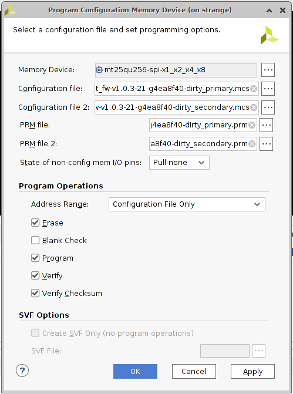

# Readout Board Firmware

## Firmware for KCU 105

- Vivado version: 2020.2

### Loading the firmware

- Connect JTAG USB connector to computer
- `Open Hardware manager`
- `Open target` -> `auto connect`. If multiple boards are connected, make sure you select the right one.
- Right click on `xcku`, select bitstream file (Firmware releases on [gitlab](https://gitlab.cern.ch/cms-etl-electronics/module_test_fw/-/releases))
  - latest tested firmware version: v1.0.3
  - If firmware was loaded correctly, single or double cylon mode should run on the KCU board LEDs

### Loading the firmware persistently

The KCU105 has a dual Quad-SPI memory which allows a firmware image to be persistently programmed onto the board. The dual configuration allows for programming from two SPI flash memories in parallel (programming 8 bits per clock cycle).

To load the firmware into the flash to keep it even after a power cycle:

- Right click on FPGA, `Add Configuration Memory Device`
- `mt25qu256-spi-x1_x2_x4_x8` -> OK
- OK
- In the `Program Configuration Memory Device` menu:
  - Set `Configuration file` and `Configuration file 2` to the primary and secondary `.mcs` files
  - Set `PRM file` and `PRM file 2` to the primary and secondary `.prm` files
  - The default selections of `Erase` `Program`, and `Verify` are ok.
  - Click `OK`

    

## Emulator Firmware

- Quartus 21.1.0
- Needs a USB blaster. Restart computer with blaster connected if there a troubles with Quartus finding the blaster.

### Load firmware

Some instructions can be found [here](https://gitlab.cern.ch/cms-etl-electronics/etroc-emulator/-/blob/master/ETROC%20emulator%20version%201/Firmware20210608/Software_quick_start.pdf).

- Start Quartus, open a project and recompile if necessary
- Start the `Programmer` and load the default `.sof` file onto the board, or load a `.jic` file into

### Useful firmware versions

- Bounce software: for loopback tests and uplink alignment scans [gitlab](https://gitlab.cern.ch/cms-etl-electronics/etroc-emulator/-/tree/master/ETROC%20emulator%20version%201/Bounce%20test%20firmware)
- ETROC2 v1 firmware [gitlab](https://gitlab.cern.ch/cms-etl-electronics/etroc-emulator/-/tree/master/ETROC%20emulator%20version%201/Firmware20210829)

### Setting the board IP address

- The IP address of the board is set by a 4 bit switch SW12. The 4 bit switch is interpreted as a 4 bit offset which is added to a base IP address (`192.168.0.10+offset`). For example, a setting of 0 will result in `192.168.0.10`. A setting of 5 will result in `192.168.0.15`. This jumper also changes the board's MAC address so that they can be guaranteed unique on the network.
