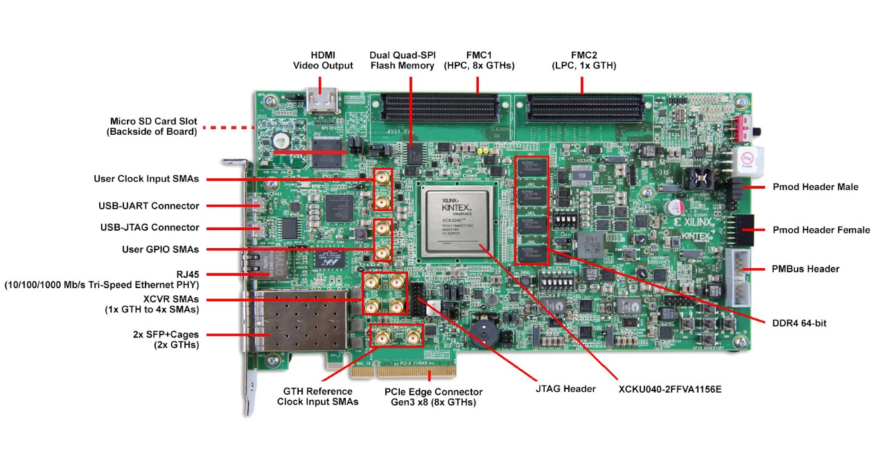

## Hardware Setup

The ETL Test Stand Firmware is designed to run on a KCU105 evaluation
board: <https://www.xilinx.com/products/boards-and-kits/kcu105.html>

The KCU105 board has optics available on 2 SFPs and on a Firefly FMC.

The two SFP modules are included with the development kit and allow for
connection to one LPGBT each. This can be used for example to connect to
two readout boards (DAQ only), or one readout board (DAQ + Trigger).

Eight additional transceivers can be connected with a Firefly FMC,
available at <https://www.samtec.com/kits/optics-fpga/14g-firefly-fmc>.
The of whether the FMC is required should be made by each test stand.

### Additional Shopping

Some additional components are needed to connect to a readout board.
Other additional components are optional.

1.  VTRX Optical Adapter

    The readout board features VTRX+ optics, which have a (female) MT12
    Ferrule. To connect this to the KCU105 board, you need to break this
    out into LC connectors.

    The "proper" way to connect to the VTRX is with an actual MT ferrule
    with a spring clamp, but a male MTP connector works fine.

    1.  Option A: Fanout Cable

        You can use an "octopus cable" e.g.

        -   <https://www.fibertronics.com/1m-mtp-male-to-12-lc-upc-12-fiber-multimode-om3-50125-breakout-cable>
        -   1m, MTP Male to 12 LC UPC, 12 Fiber Multimode OM3 50/125
            Fanout Cable
        -   $130

        You also then need some LC fibers of whatever length you choose.
        e.g.

        -   <https://www.fibertronics.com/3m-lc-to-lc-duplex-om3-multimode-fiber-optic-patch-cable>
        -   3m, LC to LC, Duplex, OM3 Multimode Patch Cable
        -   Multimode, OM3, 50/125, 10Gb, 3.0mm, PVC (OFNR)

        You also need some LC adapters, e.g.

        -   <https://www.fibertronics.com/lc-duplex-mm-10gb-om3-adapter-wo-flange-aqua>
        -   LC Duplex Aqua Adapter without Flange

    2.  Option B: Cassette

        Another nice option that can be quite a bit more organized on
        the benchtop is to use a fiber cassette. e.g.

        You need one cassette:

        -   FHD-1MTP6LCDSMFA
        -   <https://www.fs.com/products/57016.html>

        You need an MTP M-F connector

        -   MT-KL4EAP001MCS
        -   1m, 12 Fiber MTP Cable, Multimode OM4, MPO - MPO
        -   Male to Female, Multimode, OM4, 50/125, ONFP, Method A
        -   <https://www.fibertronics.com/1m-12-fiber-mtp-m-f-multimode-om4-method-a-4>

        You need several OM3 LC patch cables (of the length you prefer),
        e.g.

        -   PC-KK7S3AV01M
        -   1m, LC to LC, Simplex, Multimode 50/125 Patch Cable
        -   Multimode, OM3, 50/125, 3.0mm, PVC (OFNR)
        -   <https://www.fibertronics.com/1m-lc-to-lc-simplex-multimode-50125-patch-cable>

2.  Firefly Mezzanine Optical Components

    The firefly adapter has a single MTP24 connector which mates with an
    MPO male (see drawing at:
    <http://suddendocs.samtec.com/prints/ref-193429-01-mkt.pdf>)

    This can be broken out to LCs with a cassette , e.g.
    <https://www.fs.com/products/57024.html>, which mates with an MPO
    female. We

    The two can be connected together with a 24 fiber MPO Male to Female
    cable, e.g.
    <https://www.fibertronics.com/1m-24-fiber-mtp-m-f-multimode-om4-pin-1-13-2>

    You then need a number of LC fiber patch cables to connect to the
    readout boards (through the breakouts described above).

3.  MT-MPO Adapter

    An MT to MPO adapter is recommended to ensure a good connection. An
    example is Molex p/n 1061141150:

    -   <https://www.digikey.com/en/products/detail/1061141150/WM10355-ND/4504562?itemSeq=345960714>

4.  Clock Source
